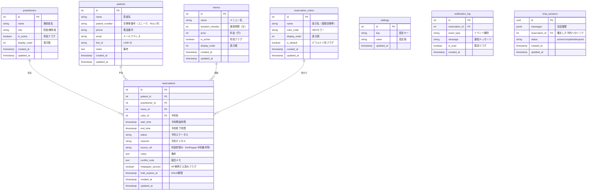

# 接骨院予約管理システム SPEC v3

**Version:** 3.0
**Date:** 2026-03-21
**Author:** まこと（設計） + Claude（技術仕様）
**変更履歴:**
- v2.0 (2026-03-10): 初版
- v3.0 (2026-03-21): Web予約削除、予約色分けカスタマイズ追加、チャットボット予約追加

---

## 1. プロジェクト概要

### 1.1 目的

弟が院長を務める接骨院の**紙ボード予約管理を完全にデジタル化**し、以下を実現する：

1. 全チャネル（電話・窓口・LINE・HotPepper・チャットボット）の予約を**一元管理**
2. 予約バッティングの**完全防止**
3. HotPepper予約の**自動取り込み**とバッティング検出
4. AIエージェントによる**入力補助・通知・外部連携**
5. 施術中でも対応できる**最小操作のUI**

### 1.2 現場の課題（設計の根拠）

| # | 課題 | 影響度 |
|---|------|--------|
| 1 | 予約管理が紙ボードのみ。転記忘れでバッティング発生 | 致命的 |
| 2 | HotPepper予約は2週間ごとに手動チェック。既存予約との突合が間に合わない | 致命的 |
| 3 | HotPepper側に空き状況が反映されず、来院時にバッティング発覚 | 致命的 |
| 4 | LINE予約は通知→確認→返信→ボード転記の多段階フロー | 高 |
| 5 | ホームページがなく、Web予約不可（→チャットボットで対応予定） | 中 |
| 6 | 事務員なし。施術中の電話・LINE対応が常態化 | 高 |
| 7 | 忙しい日ほど事務対応が追いつかず、トラブル多発 | 高 |

### 1.3 設計コンセプト

- **AI補助型予約管理**：AIは提案・通知・解析まで。最終決定権はシステムルールまたは人間
- **現場ファースト**：施術中の片手操作を前提としたUI設計
- **段階的拡張**：Phase 1で紙ボード置き換え→Phase 2で外部連携→Phase 3でチャットボット予約・RPA

### 1.4 フェーズ定義

| Phase | 内容 | 位置づけ |
|-------|------|----------|
| **Phase 1** | 予約台帳UI + 予約CRUD + 競合検出 + 施術者/メニュー管理 + 色分けカスタマイズ | 紙ボードの完全置き換え |
| **Phase 2** | HotPepperメール解析→自動登録、LINE予約読取→登録提案、通知システム | 外部チャネル自動連動 |
| **Phase 3** | HPチャットボット予約 + HotPepper RPA + 音声入力補助 | AIエージェント拡張 |

> **本仕様書はPhase 1〜Phase 3 を対象とする。**

---

## 2. 技術スタック

### 2.1 構成

```
┌─────────────────────────────────────────────────┐
│                  Frontend                        │
│         React + TypeScript + Vite                │
│   （タイムテーブルUI / 管理画面 / 通知）          │
└─────────────┬───────────────────────────────────┘
              │ REST API (JSON)
              │ SSE (Server-Sent Events: リアルタイム通知)
┌─────────────┴───────────────────────────────────┐
│                  Backend                         │
│         FastAPI + SQLAlchemy + Alembic           │
│   （予約API / 競合検出 / AIエージェント）          │
└─────────────┬───────────────────────────────────┘
              │
┌─────────────┴───────────────────────────────────┐
│                  Database                        │
│         PostgreSQL                               │
│   （EXCLUDE制約 / 排他ロック）                    │
└─────────────────────────────────────────────────┘
```

### 2.2 選定理由

| 技術 | 理由 |
|------|------|
| **React + TypeScript** | ドラッグ操作・5分刻みタイムテーブル・音通知・SSEリアルタイム更新をネイティブに実装可能。Streamlitでは不可能 |
| **FastAPI** | async対応、自動OpenAPIドキュメント生成、型安全 |
| **SQLAlchemy + Alembic** | ORMによる安全なDB操作 + マイグレーション管理（テーブル変更履歴の追跡・巻き戻し） |
| **PostgreSQL** | EXCLUDE制約による時間帯重複防止をDB層で保証。SQLiteでは不可能 |

### 2.3 開発環境

```
repo/
├── backend/
│   ├── app/
│   │   ├── main.py              # FastAPIエントリポイント
│   │   ├── config.py            # 設定管理
│   │   ├── database.py          # DB接続・セッション
│   │   ├── models/              # SQLAlchemyモデル
│   │   │   ├── __init__.py
│   │   │   ├── practitioner.py  # 施術者
│   │   │   ├── patient.py       # 患者
│   │   │   ├── menu.py          # 施術メニュー
│   │   │   ├── reservation.py   # 予約
│   │   │   └── setting.py       # システム設定
│   │   ├── schemas/             # Pydanticスキーマ（リクエスト/レスポンス）
│   │   │   ├── __init__.py
│   │   │   ├── practitioner.py
│   │   │   ├── patient.py
│   │   │   ├── menu.py
│   │   │   ├── reservation.py
│   │   │   └── setting.py
│   │   ├── api/                 # APIルーター
│   │   │   ├── __init__.py
│   │   │   ├── practitioners.py
│   │   │   ├── patients.py
│   │   │   ├── menus.py
│   │   │   ├── reservations.py
│   │   │   ├── settings.py
│   │   │   └── sse.py           # Server-Sent Events
│   │   ├── services/            # ビジネスロジック
│   │   │   ├── __init__.py
│   │   │   ├── reservation_service.py   # 予約CRUD + 競合検出
│   │   │   ├── conflict_detector.py     # 競合検出ロジック
│   │   │   ├── notification_service.py  # 通知管理
│   │   │   ├── hotpepper_mail.py        # Phase 2: メール解析
│   │   │   └── line_webhook.py          # Phase 2: LINE連携
│   │   └── agents/              # Phase 2: AIエージェント
│   │       ├── __init__.py
│   │       ├── mail_parser.py   # メール解析エージェント
│   │       └── line_parser.py   # LINEメッセージ解析エージェント
│   ├── alembic/                 # DBマイグレーション
│   │   ├── alembic.ini
│   │   ├── env.py
│   │   └── versions/
│   ├── tests/
│   │   ├── test_reservations.py
│   │   ├── test_conflicts.py
│   │   └── test_hotpepper_parser.py
│   ├── requirements.txt
│   └── Dockerfile
├── frontend/
│   ├── src/
│   │   ├── App.tsx
│   │   ├── main.tsx
│   │   ├── components/
│   │   │   ├── TimeTable/
│   │   │   │   ├── TimeTable.tsx        # メインタイムテーブル
│   │   │   │   ├── TimeSlot.tsx         # 5分刻みスロット
│   │   │   │   ├── ReservationBlock.tsx # 予約ブロック表示
│   │   │   │   └── DragSelect.tsx       # ドラッグ選択
│   │   │   ├── ReservationForm/
│   │   │   │   ├── ReservationForm.tsx  # 予約登録フォーム
│   │   │   │   └── PatientSearch.tsx    # 患者検索・選択
│   │   │   ├── Notification/
│   │   │   │   ├── NotificationBell.tsx # 通知ベル
│   │   │   │   └── AlertPopup.tsx       # アラートポップアップ
│   │   │   └── Settings/
│   │   │       ├── PractitionerManager.tsx
│   │   │       ├── MenuManager.tsx
│   │   │       └── SystemSettings.tsx
│   │   ├── hooks/
│   │   │   ├── useReservations.ts
│   │   │   ├── useSSE.ts               # SSEリアルタイム更新
│   │   │   └── useNotification.ts      # 音通知
│   │   ├── api/
│   │   │   └── client.ts               # APIクライアント
│   │   ├── types/
│   │   │   └── index.ts                # TypeScript型定義
│   │   └── utils/
│   │       ├── timeUtils.ts            # 5分刻み計算
│   │       └── soundUtils.ts           # 通知音再生
│   ├── public/
│   │   └── sounds/
│   │       ├── notification.mp3        # 通常通知音
│   │       └── alert.mp3              # 緊急アラート音
│   ├── package.json
│   ├── tsconfig.json
│   ├── vite.config.ts
│   └── Dockerfile
├── docker-compose.yml
├── .env.example
├── SPEC_v2.md                   # 本仕様書
├── COPILOT_INSTRUCTIONS.md      # 実装指示書
└── README.md
```

---

## 3. データベース設計

### 3.1 ER図（Mermaid）



### 3.2 テーブル詳細

#### reservations テーブル

| カラム | 型 | 制約 | 説明 |
|--------|-----|------|------|
| id | SERIAL | PK | 予約ID |
| patient_id | INT | FK → patients.id, NULL可 | 患者（飛び込みはNULL） |
| practitioner_id | INT | FK → practitioners.id, NOT NULL | 担当施術者 |
| menu_id | INT | FK → menus.id, NULL可 | 施術メニュー |
| color_id | INT | FK → reservation_colors.id, NULL可 | 予約色 |
| start_time | TIMESTAMPTZ | NOT NULL | 予約開始時間 |
| end_time | TIMESTAMPTZ | NOT NULL | 予約終了時間 |
| status | VARCHAR(20) | NOT NULL, DEFAULT 'PENDING' | ステータス（後述） |
| channel | VARCHAR(20) | NOT NULL | チャネル（後述） |
| source_ref | VARCHAR(100) | NULL可 | 外部参照ID |
| notes | TEXT | NULL可 | 備考 |
| conflict_note | TEXT | NULL可 | 競合時のメモ |
| hotpepper_synced | BOOLEAN | DEFAULT false | HotPepper側押さえ済みか |
| hold_expires_at | TIMESTAMPTZ | NULL可 | HOLD期限 |
| created_at | TIMESTAMPTZ | DEFAULT NOW() | 作成日時 |
| updated_at | TIMESTAMPTZ | DEFAULT NOW() | 更新日時 |

#### EXCLUDE制約（PostgreSQL固有・二重予約防止の要）

```sql
-- btree_gist拡張が必要
CREATE EXTENSION IF NOT EXISTS btree_gist;

-- 同一施術者の時間帯重複を防止
-- CONFIRMED, HOLD, PENDING のみを対象（CANCELLED等は除外）
ALTER TABLE reservations ADD CONSTRAINT no_overlap
  EXCLUDE USING gist (
    practitioner_id WITH =,
    tstzrange(start_time, end_time) WITH &&
  )
  WHERE (status IN ('CONFIRMED', 'HOLD', 'PENDING'));
```

> **これがこのシステムの心臓部。** アプリ層のバグがあっても、DB層で二重予約を物理的にブロックする。

### 3.3 予約ステータス

```
PENDING ──────→ CONFIRMED ──────→ CHANGE_REQUESTED ──→ CANCELLED（旧）
   │                │                                     + CONFIRMED（新）
   │                │
   │                └──→ CANCEL_REQUESTED ──→ CANCELLED
   │
   └──→ EXPIRED（HOLD期限切れ）
   └──→ REJECTED（競合で却下）

HOLD ──→ CONFIRMED（承認）
  └──→ EXPIRED（期限切れ）
```

| ステータス | 意味 | 遷移元 | 遷移先 |
|-----------|------|--------|--------|
| PENDING | 仮予約（自動確定条件未充足） | 新規登録 | CONFIRMED, REJECTED, EXPIRED |
| HOLD | 一時確保（時間制限付き） | 変更先枠の仮押さえ | CONFIRMED, EXPIRED |
| CONFIRMED | 予約確定 | PENDING, HOLD | CHANGE_REQUESTED, CANCEL_REQUESTED |
| CHANGE_REQUESTED | 変更申請中 | CONFIRMED | CANCELLED（旧）+ CONFIRMED（新） |
| CANCEL_REQUESTED | キャンセル申請中 | CONFIRMED | CANCELLED |
| CANCELLED | キャンセル確定 | CANCEL_REQUESTED, CHANGE_REQUESTED | （終端） |
| REJECTED | 競合で却下 | PENDING | （終端） |
| EXPIRED | 期限切れ | HOLD, PENDING | （終端） |

### 3.4 予約チャネル

| チャネル値 | 説明 | 処理方式 |
|-----------|------|----------|
| PHONE | 電話予約 | スタッフ手入力 |
| WALK_IN | 窓口（店頭）予約 | スタッフ手入力 |
| LINE | LINE予約 | Phase 2: AI解析→スタッフ確認 |
| HOTPEPPER | HotPepper予約 | Phase 2: メール解析→自動登録 |
| CHATBOT | チャットボット予約 | Phase 3: AI会話→自動CONFIRMED |

### 3.5 初期設定データ（settings テーブル）

| key | value | 説明 |
|-----|-------|------|
| hold_duration_minutes | 10 | HOLD自動失効時間（分） |
| hotpepper_priority | true | HotPepper予約を優先するか |
| business_hour_start | 09:00 | 営業開始時間 |
| business_hour_end | 20:00 | 営業終了時間 |
| business_days | 1,2,3,4,5,6 | 営業曜日（0=日,1=月...6=土） |
| slot_interval_minutes | 5 | タイムテーブルの時間刻み |
| notification_sound | true | 通知音ON/OFF |

---

## 4. API設計

### 4.1 エンドポイント一覧

#### 施術者（practitioners）

| Method | Path | 説明 | Phase |
|--------|------|------|-------|
| GET | /api/practitioners | 施術者一覧 | 1 |
| POST | /api/practitioners | 施術者追加 | 1 |
| PUT | /api/practitioners/{id} | 施術者編集 | 1 |
| DELETE | /api/practitioners/{id} | 施術者無効化（論理削除） | 1 |

#### 患者（patients）

| Method | Path | 説明 | Phase |
|--------|------|------|-------|
| GET | /api/patients | 患者一覧（検索対応） | 1 |
| GET | /api/patients/{id} | 患者詳細 | 1 |
| POST | /api/patients | 患者登録 | 1 |
| PUT | /api/patients/{id} | 患者編集 | 1 |
| GET | /api/patients/search?q={query} | 患者検索（名前・診察券番号・電話番号） | 1 |

#### 施術メニュー（menus）

| Method | Path | 説明 | Phase |
|--------|------|------|-------|
| GET | /api/menus | メニュー一覧 | 1 |
| POST | /api/menus | メニュー追加 | 1 |
| PUT | /api/menus/{id} | メニュー編集 | 1 |
| DELETE | /api/menus/{id} | メニュー無効化（論理削除） | 1 |

#### 予約（reservations）— 本システムの核

| Method | Path | 説明 | Phase |
|--------|------|------|-------|
| GET | /api/reservations | 予約一覧（日付範囲・施術者フィルタ） | 1 |
| GET | /api/reservations/{id} | 予約詳細 | 1 |
| POST | /api/reservations | 予約登録 | 1 |
| PUT | /api/reservations/{id} | 予約編集 | 1 |
| POST | /api/reservations/{id}/confirm | PENDING → CONFIRMED | 1 |
| POST | /api/reservations/{id}/cancel-request | キャンセル申請 | 1 |
| POST | /api/reservations/{id}/cancel-approve | キャンセル承認 | 1 |
| POST | /api/reservations/{id}/change-request | 変更申請（新時間帯をHOLD） | 1 |
| POST | /api/reservations/{id}/change-approve | 変更承認（旧CANCELLED→新CONFIRMED） | 1 |
| GET | /api/reservations/conflicts | 競合予約一覧 | 1 |

#### 設定（settings）

| Method | Path | 説明 | Phase |
|--------|------|------|-------|
| GET | /api/settings | 全設定取得 | 1 |
| PUT | /api/settings/{key} | 設定変更 | 1 |

#### 予約色設定（reservation-colors）

| Method | Path | 説明 | Phase |
|--------|------|------|-------|
| GET | /api/reservation-colors | 色設定一覧 | 1 |
| POST | /api/reservation-colors | 色設定追加 | 1 |
| PUT | /api/reservation-colors/{id} | 色設定編集 | 1 |
| DELETE | /api/reservation-colors/{id} | 色設定削除 | 1 |

#### 通知（notifications）

| Method | Path | 説明 | Phase |
|--------|------|------|-------|
| GET | /api/notifications | 通知一覧（未読優先） | 1 |
| PUT | /api/notifications/{id}/read | 既読にする | 1 |
| GET | /api/sse/events | SSEストリーム（リアルタイム通知） | 1 |

#### Phase 2: 外部連携

| Method | Path | 説明 | Phase |
|--------|------|------|-------|
| POST | /api/hotpepper/parse-email | HotPepperメール解析→予約登録 | 2 |
| GET | /api/hotpepper/pending-sync | HP側未押さえの予約一覧 | 2 |
| POST | /api/hotpepper/{id}/mark-synced | HP側押さえ済みマーク | 2 |
| POST | /api/line/webhook | LINE Webhook受信 | 2 |
| POST | /api/line/parse-message | LINEメッセージ解析→予約提案 | 2 |

#### Phase 3: チャットボット

| Method | Path | 説明 | Phase |
|--------|------|------|-------|
| POST | /api/chatbot/session | 新規チャットセッション作成 | 3 |
| POST | /api/chatbot/message | チャットメッセージ送信→AI応答取得 | 3 |
| GET | /api/chatbot/session/{id} | セッション履歴取得 | 3 |

### 4.2 主要APIの詳細

#### POST /api/reservations（予約登録）

**リクエスト:**
```json
{
  "patient_id": 1,
  "practitioner_id": 1,
  "menu_id": 2,
  "start_time": "2026-03-15T10:00:00+09:00",
  "end_time": "2026-03-15T10:45:00+09:00",
  "channel": "PHONE",
  "notes": "腰痛"
}
```

**処理フロー:**
```
1. バリデーション
   - start_time < end_time
   - 営業時間内か
   - 5分刻みか
   - practitioner_id が有効か

2. 自動確定判定
   条件すべて満たす → CONFIRMED
   - 営業時間内
   - menu_id が確定
   - practitioner_id が確定
   - 同一施術者の同時間帯にCONFIRMED/HOLD/PENDINGなし
   
   条件不足 → PENDING

3. DB INSERT（EXCLUDE制約でバッティング最終防止）
   - 競合時は IntegrityError → 409 Conflict レスポンス

4. 通知発火
   - SSEで全クライアントに新規予約イベント送信
   - notification_log にレコード追加

5. レスポンス返却
```

**レスポンス（201 Created）:**
```json
{
  "id": 42,
  "patient": { "id": 1, "name": "田中太郎", "patient_number": "123" },
  "practitioner": { "id": 1, "name": "院長" },
  "menu": { "id": 2, "name": "骨盤矯正", "duration_minutes": 45 },
  "start_time": "2026-03-15T10:00:00+09:00",
  "end_time": "2026-03-15T10:45:00+09:00",
  "status": "CONFIRMED",
  "channel": "PHONE",
  "notes": "腰痛",
  "created_at": "2026-03-10T14:30:00+09:00"
}
```

**エラーレスポンス（409 Conflict）:**
```json
{
  "detail": "予約が競合しています",
  "conflicting_reservations": [
    {
      "id": 38,
      "patient_name": "鈴木花子",
      "start_time": "2026-03-15T09:30:00+09:00",
      "end_time": "2026-03-15T10:15:00+09:00",
      "status": "CONFIRMED"
    }
  ]
}
```

#### GET /api/reservations（タイムテーブル用）

**クエリパラメータ:**
```
?start_date=2026-03-10&end_date=2026-03-16&practitioner_id=1
```

**レスポンス:**
```json
{
  "reservations": [
    {
      "id": 42,
      "patient": { "id": 1, "name": "田中太郎", "patient_number": "123" },
      "practitioner_id": 1,
      "menu": { "id": 2, "name": "骨盤矯正", "duration_minutes": 45 },
      "start_time": "2026-03-15T10:00:00+09:00",
      "end_time": "2026-03-15T10:45:00+09:00",
      "status": "CONFIRMED",
      "channel": "PHONE",
      "hotpepper_synced": true
    }
  ]
}
```

---

## 5. フロントエンド設計

### 5.1 画面一覧

| 画面 | パス | 説明 | Phase |
|------|------|------|-------|
| タイムテーブル | / | メイン画面。週間予約ボード | 1 |
| 予約登録モーダル | （モーダル） | 予約の新規登録・編集 | 1 |
| 患者管理 | /patients | 患者一覧・検索・登録 | 1 |
| 施術者管理 | /settings/practitioners | 施術者の追加・編集 | 1 |
| メニュー管理 | /settings/menus | 施術メニューの追加・編集 | 1 |
| 予約色設定 | /settings/colors | 予約色の追加・編集・削除 | 1 |
| システム設定 | /settings | HOLD時間・営業時間等の設定 | 1 |
| 通知一覧 | （サイドパネル） | 通知履歴・未読管理 | 1 |
| HotPepper同期 | /hotpepper | HP未同期予約の確認・押さえ済み管理 | 2 |
| チャットボット設定 | /settings/chatbot | チャットボットのON/OFF・メッセージ設定 | 3 |

### 5.2 タイムテーブルUI仕様（メイン画面）

**これがシステムの顔。紙ボードの完全置き換え。**

#### レイアウト

```
┌──────────────────────────────────────────────────────────────┐
│  [←] 2026年3月10日〜16日 [→] [今日]   🔔3  [設定]           │
├──────┬──────────┬──────────┬──────────┬─────────────────────┤
│ 時間 │ 院長     │ バイトA  │ (3人目)  │ ← 施術者ごとの列    │
├──────┼──────────┼──────────┼──────────┤                     │
│09:00 │          │          │          │                     │
│09:05 │          │          │          │ ← 5分刻み           │
│09:10 │ ████████ │          │          │                     │
│09:15 │ ██田中██ │          │          │ ← 予約ブロック      │
│09:20 │ ██骨盤██ │          │          │   （色でステータス） │
│09:25 │ ██矯正██ │          │          │                     │
│09:30 │ ████████ │ ████████ │          │                     │
│09:35 │          │ ██鈴木██ │          │                     │
│09:40 │          │ ██HP██── │          │ ← チャネル表示      │
│09:45 │          │ ████████ │          │                     │
│09:50 │          │          │          │                     │
│...   │          │          │          │                     │
```

#### 表示切替

- **日表示**（デフォルト）：1日の全施術者を横並び
- **週表示**：1施術者の1週間を横並び

#### 予約ブロックの色分け

色は**管理者がカスタマイズ可能**。Googleカレンダーの予定色のように、施術カテゴリや診療区分ごとに自由に設定できる。

**色の決定ロジック（優先順位）:**

| 優先度 | 条件 | 色 | 変更可否 |
|--------|------|-----|---------|
| 1 | 競合あり（conflict_note） | 赤 #EF4444 | **固定** |
| 2 | CANCEL_REQUESTED | 薄赤 #FCA5A5 | **固定** |
| 3 | CHANGE_REQUESTED | オレンジ #FB923C | **固定** |
| 4 | HOLD | 紫 #8B5CF6 | **固定** |
| 5 | PENDING | 黄 #F59E0B | **固定** |
| 6 | CONFIRMED + color_id あり | ユーザー設定色 | **管理者が設定** |
| 7 | CONFIRMED + color_id なし | デフォルト色 | **管理者が設定** |

**初期設定色（管理画面で変更・追加・削除可能）:**
- 保険診療: #3B82F6（ブルー）— デフォルト
- 自費診療: #10B981（グリーン）
- 初診: #F97316（オレンジ）

#### チャネルアイコン

予約ブロック内に小さいアイコンで表示：
- 📞 電話
- 🏥 窓口
- 💬 LINE
- 🔥 HotPepper
- 🤖 チャットボット

#### 操作

| 操作 | 動作 |
|------|------|
| 空きスロットをクリック | その時刻で予約登録モーダルを開く |
| 空きスロットをドラッグ | 開始〜終了時刻を範囲指定して予約登録モーダルを開く |
| 予約ブロックをクリック | 予約詳細を表示（編集・予約変更・キャンセル申請のアクション） |

#### 5分刻みの実装

```typescript
// 時間スロットの生成（09:00〜20:00、5分刻み = 132スロット/日）
const SLOT_INTERVAL = 5; // 分
const DAY_START = 9 * 60;  // 09:00 = 540分
const DAY_END = 20 * 60;   // 20:00 = 1200分

const slots = [];
for (let m = DAY_START; m < DAY_END; m += SLOT_INTERVAL) {
  slots.push({
    minutes: m,
    label: `${Math.floor(m/60)}:${String(m%60).padStart(2,'0')}`
  });
}
// → 132スロット: 09:00, 09:05, 09:10, ..., 19:55
```

### 5.3 予約登録モーダル

```
┌─────────────────────────────────────┐
│  新規予約登録                    [×] │
├─────────────────────────────────────┤
│                                     │
│  患者: [🔍 検索...          ▼]      │
│        （名前・診察券番号・電話）    │
│        [+ 新規患者登録]             │
│                                     │
│  施術者: [院長 ▼]                   │
│                                     │
│  メニュー: [骨盤矯正 (45分) ▼]     │
│                                     │
│  日時: 2026/03/15                   │
│  開始: [10:00 ▼]  終了: [10:45 ▼]  │
│  ※メニュー選択で自動計算           │
│  ※手動変更も可能（5分刻み）        │
│                                     │
│  チャネル: [📞電話 ▼]              │
│                                     │
│  色: [■ 保険診療 ▼]               │
│                                     │
│  備考: [                    ]       │
│                                     │
│  [キャンセル]        [予約登録]     │
└─────────────────────────────────────┘
```

**ポイント:**
- メニュー選択時にduration_minutesから自動で終了時間を計算
- 手動で終了時間を変更可能（5分刻み）
- 患者検索はインクリメンタルサーチ（2文字以上で検索開始）
- 「新規患者登録」でインラインで患者を追加可能

### 5.4 通知システム（Phase 1 + Phase 2）

#### SSE（Server-Sent Events）

```typescript
// フロントエンド: SSE接続
const eventSource = new EventSource('/api/sse/events');

eventSource.addEventListener('new_reservation', (e) => {
  const data = JSON.parse(e.data);
  // タイムテーブル更新 + 通知音再生 + ポップアップ表示
});

eventSource.addEventListener('conflict_detected', (e) => {
  // 強アラート音 + 赤ポップアップ
});

eventSource.addEventListener('cancel_requested', (e) => {
  // 通知音 + ポップアップ
});
```

#### 通知イベント

| イベント | 音 | 表示 | Phase |
|---------|-----|------|-------|
| 新規予約登録 | 通常音 | ポップアップ | 1 |
| 競合検出 | 強アラート音 | 赤ポップアップ + 点滅 | 1 |
| キャンセル申請 | 通常音 | ポップアップ | 1 |
| 変更申請 | 通常音 | ポップアップ | 1 |
| HotPepper予約取込 | 通常音 | ポップアップ + HP押さえリマインド | 2 |
| LINE予約提案 | 通常音 | ポップアップ + 承認ボタン | 2 |
| HOLD期限切れ | 警告音 | 黄色ポップアップ | 1 |

#### 音制御

- 営業時間内: ON
- 営業時間外: OFF（設定で制御）
- ブラウザのAudio API使用。初回操作時にユーザージェスチャーで音声許可を取得

---

## 6. ビジネスロジック詳細

### 6.1 自動確定ルール

予約登録時、以下の**全条件**を満たす場合に自動CONFIRMED：

1. 営業時間内の予約である
2. `menu_id` が指定されている（施術メニュー確定）
3. `practitioner_id` が指定されている（担当施術者確定）
4. `start_time` と `end_time` が確定している
5. 同一施術者の同時間帯に CONFIRMED / HOLD / PENDING の予約がない

**1つでも未充足 → PENDING（仮予約）**

### 6.2 HOLD処理

#### 目的
- 予約変更時の新時間帯の一時確保
- 競合防止

#### フロー
```
HOLDリクエスト
  ↓
DB INSERT (status=HOLD, hold_expires_at=NOW()+設定分)
  ↓
バックグラウンドジョブで期限監視
  ↓
期限切れ → status=EXPIRED に自動変更 + 通知
```

#### 自動失効
- バックグラウンドタスク（FastAPIのon_startupまたはAPScheduler）
- 1分間隔でhold_expires_at < NOW()のレコードをEXPIREDに更新
- 失効時にSSEで通知

### 6.3 キャンセルフロー

```
キャンセル要求（UI or LINE or 電話）
  ↓
status → CANCEL_REQUESTED
予約枠はロック維持（他の予約は入れない）
  ↓
管理画面に通知
  ↓
スタッフが承認
  ↓
status → CANCELLED
予約枠解放
  ↓
HotPepper経由の予約の場合:
  「HotPepper側もキャンセルしてください」リマインド通知
```

### 6.4 変更フロー

```
変更申請（新しい日時を指定）
  ↓
新時間帯をHOLDとして確保（競合チェック）
  ↓
旧予約: status → CHANGE_REQUESTED
  ↓
管理画面に通知（旧予約と新HOLD予約を並べて表示）
  ↓
スタッフが承認
  ↓
旧予約: status → CANCELLED
新HOLD: status → CONFIRMED
  ↓
HotPepper経由の場合:
  「HotPepper側も変更してください」リマインド通知
```

### 6.5 競合検出（排他制御）

```python
# サービス層での競合検出
async def create_reservation(data: ReservationCreate, db: AsyncSession):
    try:
        reservation = Reservation(**data.dict())
        reservation.status = determine_status(data, db)  # 自動確定判定
        db.add(reservation)
        await db.flush()  # EXCLUDE制約がここで発動
        await db.commit()
        return reservation
    except IntegrityError as e:
        await db.rollback()
        if "no_overlap" in str(e):
            # 競合予約を取得して返す
            conflicts = await get_conflicting_reservations(
                db, data.practitioner_id, data.start_time, data.end_time
            )
            raise ConflictError(conflicts)
        raise
```

---

## 7. Phase 2: 外部チャネル連携

### 7.1 HotPepperメール解析

#### 概要
HotPepperからの予約完了メールをAI（LLM）で解析し、予約データを抽出して自動登録する。

#### 処理フロー

```
メール取得（IMAP or Gmail API）
  ↓
件名フィルタ（「ホットペッパービューティー」等）
  ↓
AIエージェント（Google Gemini API）でメール本文を解析
  ↓
予約データ抽出:
  - 顧客名
  - 予約日時
  - 施術メニュー
  - 予約番号（source_ref）
  ↓
本システムに予約登録（channel=HOTPEPPER）
  ↓
競合チェック:
  競合なし → CONFIRMED + 通知
  競合あり → CONFIRMED + CONFLICT通知（強アラート）
  ※HotPepper予約は外部で確定済みのため、競合があっても登録する
  ※conflict_note に競合情報を記録
  ↓
管理画面に通知:
  「HotPepper予約が入りました: ○○様 3/15 10:00-10:45」
```

#### メール取得アダプター

```python
# 抽象化: メールプロバイダー非依存
class MailFetcher(ABC):
    @abstractmethod
    async def fetch_new_emails(self, since: datetime) -> list[Email]: ...

class GmailFetcher(MailFetcher):
    """Gmail API (OAuth2)"""
    ...

class IMAPFetcher(MailFetcher):
    """汎用IMAP (Yahoo!メール等)"""
    ...
```

#### AIメール解析プロンプト

```python
HOTPEPPER_PARSE_PROMPT = """
以下のメール本文からHotPepper予約情報を抽出してJSON形式で返してください。

抽出項目:
- customer_name: 顧客名
- reservation_date: 予約日（YYYY-MM-DD）
- reservation_time: 予約開始時間（HH:MM）
- menu_name: 施術メニュー名
- duration_minutes: 施術時間（分）※メニューから推定
- reservation_number: HotPepper予約番号

メール本文:
{email_body}

JSON:
"""
```

#### ポーリング設定
- 初期設定: 5分間隔でメールチェック
- 管理画面から間隔変更可能
- 手動実行ボタンも用意

### 7.2 HotPepper枠押さえリマインド

#### 概要
本システムに予約が入った際、HotPepper側でもその時間帯を押さえる必要がある。
API連携不可のため、**スタッフへのリマインド通知**で対応する。

#### フロー

```
本システムに予約登録（電話/窓口/LINE）
  ↓
HotPepper側の枠押さえが必要
  ↓
通知:「HotPepper側の 3/15 10:00-10:45 を押さえてください」
  ↓
スタッフがHotPepper管理画面で枠を押さえる
  ↓
本システムで「HP押さえ済み」ボタンを押す
  → hotpepper_synced = true
  ↓
未押さえ一覧画面で残タスクを確認可能
```

### 7.3 LINE予約連携

#### 概要
LINE公式アカウントのWebhookでメッセージを受信し、AIが予約意図を解析して予約提案する。

#### フロー

```
患者がLINE公式アカウントにメッセージ送信
  例:「3月15日の10時に予約したいです」
  ↓
LINE Webhook → /api/line/webhook
  ↓
AIエージェントがメッセージを解析
  - 予約意図あり → 日時・メニュー等を抽出
  - 予約意図なし → 通常メッセージとして通知のみ
  ↓
予約提案を管理画面に表示:
  「LINE: 田中様が 3/15 10:00 を希望しています [承認] [別日提案] [却下]」
  ↓
スタッフが承認 → 予約登録 + LINEで確認メッセージ自動返信
スタッフが別日提案 → LINEで代替日時を返信
```

#### LINE Messaging API設定
- LINE Developers でチャネル作成
- Webhook URLに `/api/line/webhook` を設定
- チャネルアクセストークンとチャネルシークレットを.envに設定

---

## 8. Phase 3: AIチャットボット予約

### 8.1 概要

ホームページに埋め込むAIチャットボットで、患者が会話形式で予約できるようにする。
患者は予約ボードを直接見ない。AIが間に入り、空き状況の確認・代替提案・予約確定まで行う。

**導線:**
```
ホームページ訪問
  → 右下のチャットウィジェットをクリック
  → AIと会話で予約
  → 自動CONFIRMED（患者には「予約完了しました」と表示）
  → スタッフに新規予約通知 + HotPepper枠押さえリマインド
```

### 8.2 ユーザーフロー

#### 正常系（空きあり）

```
患者:「3月15日の10時に予約したいです」

AI: 「3月15日(土) 10:00ですね。施術メニューはどちらをご希望ですか？
     ① 骨盤矯正（45分）
     ② 全身調整（60分）
     ③ 部分施術（30分）」

患者:「②でお願いします」

AI: 「3月15日(土) 10:00〜11:00 全身調整（60分）で空きがございます。
     お名前とお電話番号をお願いいたします。」

患者:「田中太郎です。090-1234-5678」

AI: 「ご予約を確定しました。
     📅 2026年3月15日(土) 10:00〜11:00
     💆 全身調整（60分）
     👤 田中太郎 様
     当日のご来院をお待ちしております。」
```

#### 空きなし → 代替提案

```
患者:「3月15日の10時に60分で予約したいです」

AI: 「申し訳ございません、10:00〜11:00は埋まっております。
     以下のお時間はいかがでしょうか？
     ① 3月15日(土) 11:30〜12:30
     ② 3月15日(土) 14:00〜15:00
     ③ 3月16日(日) 10:00〜11:00」

患者:「①で」

AI: 「お名前とお電話番号をお願いいたします。」
    （以降、正常系と同じ）
```

### 8.3 技術設計

#### アーキテクチャ

```
┌───────────────────────────────────┐
│  ホームページ                      │
│  ┌─────────────────────────┐     │
│  │  チャットウィジェット     │     │
│  │  (React / Shadow DOM)   │     │
│  └──────────┬──────────────┘     │
└─────────────┼─────────────────────┘
              │ POST /api/chatbot/message
              ▼
┌───────────────────────────────────┐
│  Backend (FastAPI)                │
│  chatbot_agent.py                 │
│    ├ Tool: get_available_menus    │
│    ├ Tool: check_availability     │
│    ├ Tool: suggest_alternatives   │
│    └ Tool: create_reservation     │
│  既存の予約API・サービスを再利用    │
└───────────────────────────────────┘
```

#### AIエージェント（Tool定義）

```python
CHATBOT_SYSTEM_PROMPT = """
あなたは接骨院の予約受付アシスタントです。
患者さんと丁寧に会話しながら、予約を受け付けてください。

ルール:
1. 予約に必要な情報を会話で収集する:
   - 希望日時
   - 施術メニュー（メニュー一覧から選択）
   - 患者名
   - 電話番号
2. 情報が揃ったら空き状況を確認する
3. 空いていれば予約を確定する
4. 空いていなければ代替候補を最大3つ提案する
5. 敬語で丁寧に対応する
6. 予約に関係ない質問には「お電話でお問い合わせください」と案内する
"""

TOOLS = [
    {
        "name": "get_available_menus",
        "description": "施術メニュー一覧を取得する"
    },
    {
        "name": "check_availability",
        "description": "指定日時に予約可能か確認する",
        "parameters": { "date": "YYYY-MM-DD", "start_time": "HH:MM", "duration_minutes": "int" }
    },
    {
        "name": "suggest_alternatives",
        "description": "空いていない場合、近い日時の空き枠を最大3件提案する",
        "parameters": { "date": "YYYY-MM-DD", "preferred_time": "HH:MM", "duration_minutes": "int", "search_days": "int (デフォルト3)" }
    },
    {
        "name": "create_reservation",
        "description": "予約を確定する（自動CONFIRMED）",
        "parameters": { "patient_name": "string", "phone": "string", "date": "YYYY-MM-DD", "start_time": "HH:MM", "menu_id": "int" }
    }
]
```

#### 空き枠検索ロジック（suggest_alternatives）

```
優先順位:
1. 同日の近い時間帯
2. 翌日以降の同じ時間帯
3. 翌日以降の近い時間帯
最大3件を返す
```

#### チャットセッション管理

- `chat_sessions` テーブルで会話履歴を管理
- `messages` カラム（JSONB）に会話履歴を保存しLLMに渡す
- 予約確定時に `reservation_id` をリンク
- セッションは24時間で自動expire

### 8.4 チャットウィジェット

#### 設置方式

```html
<!-- ホームページに貼るコード（これだけ） -->
<script src="https://your-domain.com/chatbot/widget.js"></script>
```

- React で独立ビルド → `widget.js` として出力
- Shadow DOM で外部サイトのCSSと干渉しないように隔離
- 右下にFAB（フローティングアクションボタン）を表示
- 選択肢はボタン表示（タップしやすく）

### 8.5 セキュリティ

- レート制限: 同一IPから1分間に20リクエストまで
- 予約確定: 同一セッション1時間に3件まで
- 入力サニタイズ: HTMLタグ・スクリプト除去
- CORS: チャットウィジェット設置ドメインを環境変数で許可リスト設定

---

## 9. 非機能要件

### 9.1 パフォーマンス
- タイムテーブル表示: 1秒以内
- 予約登録: 500ms以内
- SSE通知: 2秒以内に全クライアントに配信

### 9.2 セキュリティ
- 管理画面は認証必須（Phase 1はシンプルなパスワード認証、将来的にRBAC）
- APIはCORS設定で許可ドメインのみ
- 患者情報は適切にアクセス制御

### 9.3 可用性
- Docker Composeで一括起動
- PostgreSQLのバックアップ設定
- .envで環境変数管理（APIキー等をコードに直書きしない）

### 9.4 デプロイ
- 初期: ローカルPC or 院内サーバー（Docker Compose）
- 将来: クラウド（Railway / Render / VPS等）

---

## 10. 実装優先順位

### Phase 1（紙ボード完全置き換え）

```
Step 1: プロジェクト初期化
  - リポジトリ構成作成
  - Docker Compose (PostgreSQL + Backend + Frontend)
  - Alembic初期マイグレーション

Step 2: バックエンド基盤
  - DBモデル定義（全テーブル + EXCLUDE制約 + reservation_colors）
  - 施術者CRUD API
  - 患者CRUD API + 検索
  - メニューCRUD API
  - 予約色CRUD API
  - 設定API

Step 3: 予約コアロジック
  - 予約CRUD API
  - 自動確定ロジック
  - 競合検出（EXCLUDE制約 + サービス層）
  - ステータス遷移（confirm / cancel-request / cancel-approve / change-request / change-approve）
  - HOLD自動失効ジョブ

Step 4: フロントエンド基盤
  - React + Vite + TypeScript セットアップ
  - APIクライアント
  - ルーティング

Step 5: タイムテーブルUI
  - 5分刻みグリッド表示
  - 施術者列表示
  - 予約ブロック表示（カスタマイズ色分け・チャネルアイコン）
  - 日表示/週表示切替
  - 週ナビゲーション

Step 6: 予約操作UI
  - クリック→予約登録モーダル（色選択フィールド含む）
  - ドラッグ→時間範囲選択→予約登録モーダル
  - 予約ブロッククリック→詳細表示
  - 患者検索（インクリメンタルサーチ）
  - キャンセル申請→承認フロー
  - 変更申請→承認フロー

Step 7: 通知システム
  - SSE接続
  - 通知音再生
  - ポップアップ表示
  - 通知一覧

Step 8: 管理画面
  - 施術者管理
  - メニュー管理
  - 予約色管理（/settings/colors）
  - システム設定
  - シンプル認証

Step 9: テスト
  - 予約競合テスト
  - ステータス遷移テスト
  - E2Eテスト（主要フロー）
```

### Phase 2（外部チャネル自動連動）

```
Step 10: HotPepperメール解析
  - メール取得アダプター（Gmail / IMAP抽象化）
  - AIメール解析エージェント
  - 予約自動登録 + 競合検出
  - ポーリングジョブ

Step 11: HotPepper枠押さえリマインド
  - 予約登録時のHP押さえ通知
  - 未押さえ一覧画面
  - 押さえ済みマーク機能

Step 12: LINE連携
  - LINE Webhook受信
  - AIメッセージ解析エージェント
  - 予約提案→承認フロー
  - LINE自動返信

Step 13: 統合テスト
  - HotPepperメール→予約登録→競合検出→通知 のE2E
  - LINE→予約提案→承認→登録 のE2E
```

### Phase 3（AIチャットボット予約）

```
Step 14: チャットボットバックエンド
  - chat_sessions テーブル追加
  - channel に CHATBOT 追加
  - AIエージェント（Tool: check_availability / suggest_alternatives / create_reservation）
  - チャットボットAPI（session作成 / message送受信）
  - 空き枠検索ロジック（代替候補最大3件提案）
  - セッション自動expire（24時間）ジョブ
  - レート制限ミドルウェア

Step 15: チャットウィジェット
  - React チャットウィジェットコンポーネント
  - Shadow DOM で外部サイトCSS隔離
  - widget.js ビルド（scriptタグ1行で埋め込み可能）
  - FAB（フローティングアクションボタン）
  - 選択肢ボタン表示
  - セッション管理

Step 16: チャットボット管理画面 + 統合テスト
  - /settings/chatbot（ON/OFF、受付時間、メッセージカスタマイズ）
  - チャットボット→予約確定→タイムテーブル反映→HP押さえリマインド のE2E
  - 空きなし→代替提案→選択→確定 のE2E
```

---

## 11. 設計上の重要な決定事項

| 決定 | 理由 |
|------|------|
| Streamlit不採用→React | ドラッグ操作・5分刻みUI・音通知・SSEリアルタイム更新はStreamlitでは実現不可能 |
| PostgreSQL必須 | EXCLUDE制約による二重予約防止。SQLiteでは不可能 |
| HotPepper予約は競合があっても登録 | 外部で確定済みのため、システム側で拒否すると整合性が壊れる。代わりに競合アラートで人間が判断 |
| キャンセル・変更は人間承認制 | AIは提案まで。現場判断が必要な操作は人間が最終決定 |
| メニュー時間は管理画面で設定可能 | 現場の意向で柔軟に変更。コードに固定しない |
| 施術者は動的追加可能 | 増員を前提とした設計。管理画面から追加・無効化 |
| 5分刻みのタイムテーブル | 20分〜60分の多様な施術時間に対応するため |
| メール取得を抽象化 | Gmail/Yahoo!/IMAP を後から切替可能に |
| 患者向けWeb予約は実装しない | 患者がボードを直接操作するのではなく、チャットボット（AI）が仲介する方式を採用 |
| 予約色は管理者がカスタマイズ可能 | 保険診療/自費診療など現場の区分に合わせた色分けが必要。警告色は固定で安全性を確保 |
| チャットボット予約は自動CONFIRMED | EXCLUDE制約でシステム内二重予約は防止済み。HotPepperとのズレはリマインド通知で対処 |
| チャットウィジェットはscriptタグ1行で埋込可能 | ホームページ側の実装を最小限にする。Shadow DOMでCSS隔離 |
